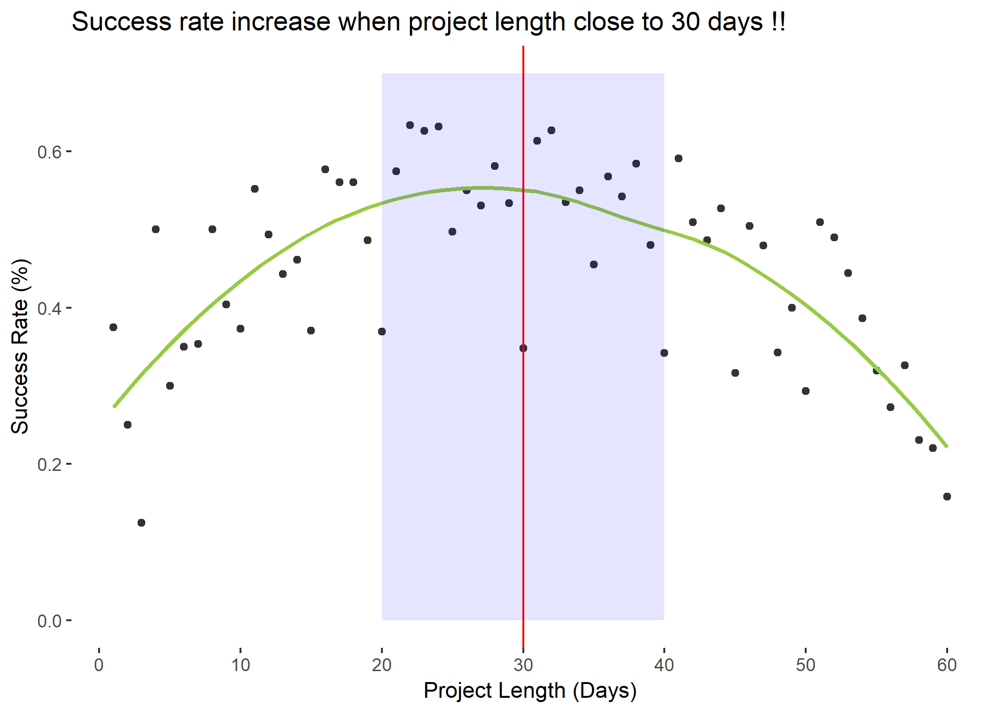

```{r}
# Course: BUAN 5210
# Title: Kickstarter crowdfunding
# Purpose: Presentation
# Date: March 21, 2019
# Author: Huy Le

```


```{r echo = FALSE}
# Clear environment of variables and functions
rm(list = ls(all = TRUE)) 

# Clear environmet of packages
if(is.null(sessionInfo()$otherPkgs) == FALSE)lapply(paste("package:", names(sessionInfo()$otherPkgs), sep=""), detach, character.only = TRUE, unload = TRUE)

```


```{r echo = FALSE, message = FALSE, warning = FALSE}
# Load librarys
# NOT LOADING LIBRARIES SINCE DOING EVERYTHING IN BASE R
#load("Mid-termProject.RData")
library(tidyverse)

```

<!-- slide1 -->
<!-- introduction -->
Introduction
=========================================
+ *My data analysis:*
    + What is Kickstarter? How does it work?
    + Dataset from kaggle in 2017, 36542 observations and 18 variables.
    + Important variables:
        - Usd.pledged: total money that funded (usd).
        - Usd.goal: the minimum goal of a campaign (usd).
        - Duration: time running a campaign.
        - Ratio: usd.pledged/usd.goal.
        - State: successful or failed.
+ *The expectation from this data analysis:*
    + For creators: Understanding how to increase your success rate beyond the project itself characteristics.
    + For backers: Recognizing which is worthy project to donate.
+ *My findings:*
    + Failed projects tend to set up very high goal.
    + Longer duration, fewer support.
    + Launched date impact on the success.
 

<!-- Finding 1 -->
Finding 1: Unsuccessful projects tend setup its goal too high.
=========================================
<div>

<br>
<p>Too high goal project seems feasible to successfully raise money in time</p>
</div>

<!-- Finding 2 -->
Finding 2: Successful rate increase when duraion close to 30 days.
=========================================
<div align="center">

</div>
<p> + Projects shoter 30days have higher success rate than those longer 30days <br>
+ Idealy, project should take length from 20-40 days</p>

<!-- Finding 3-->
Finding 3: December is not a good time to launch a campaign
=========================================
<div align="left">


</div>
<div align ="left">
+ Ratio = Funded amount/goal.
+ Ratio < 1 that means project failed to reach their goal.
+ On average, project launched in December or End in January have <1 ratio.
</div>

<!-- Conclusion -->
Conclusion and Recommendations
=========================================
+ Minimum goal and duraion have a negative effect on successful rate.
+ Setup a minium goal too high or a too long project can reduce the successful rate.
    + if Goal too high compare to the potential of project, it will make a project is less truthwothy
    + Shorter 30days project has higher success rate than longer 30days
+ Time for start a campaign also importan. A campagin start in December or end in January face more difficulty to reach their goal.

**Recommendations**:

+ *Considering divide your campaign into multi phrases with a lower minimum goal instead create one project with imposible mission.*
+ *Maximum length of campain on kickstarter is 60 days, thus consider set a possible pair of goal-duration.*
+ *20-40 days is ideal duration for campaign on Kickstarter.*
+ *Avoid to launch you campaign in December and end in January*

Contract information
=========================================
Email: lehuy@seattleu.edu
