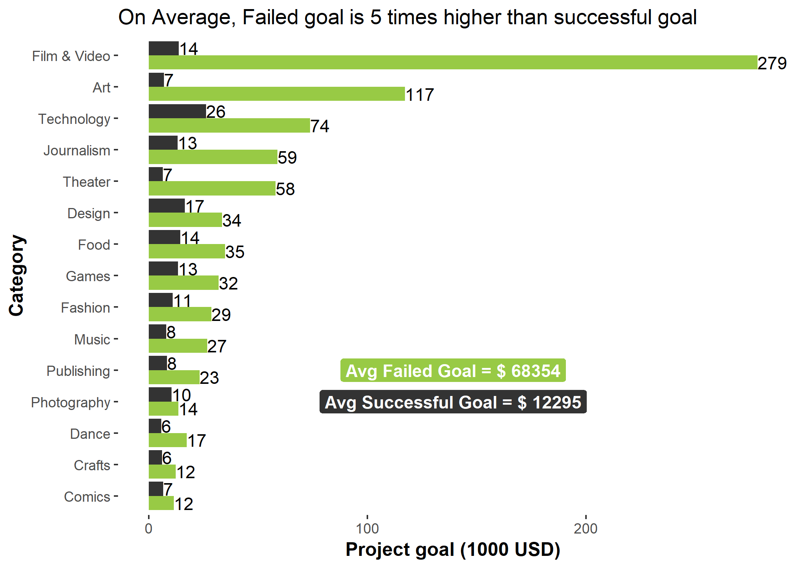
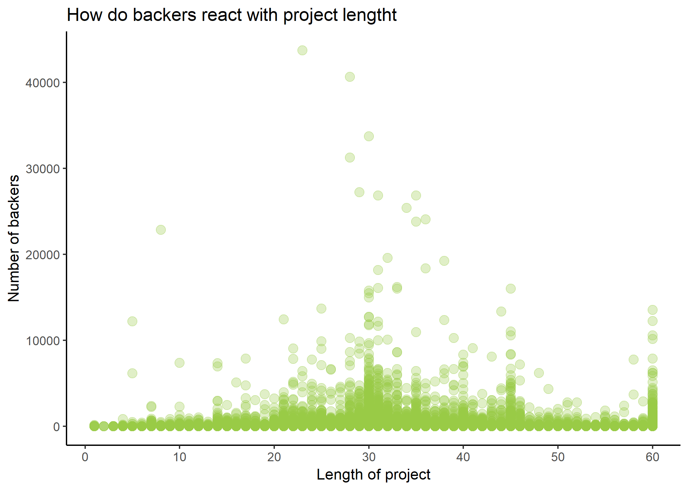
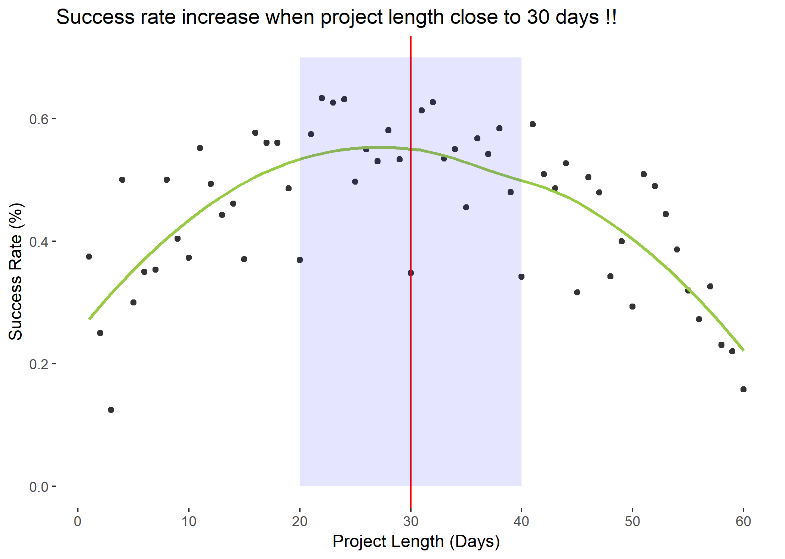
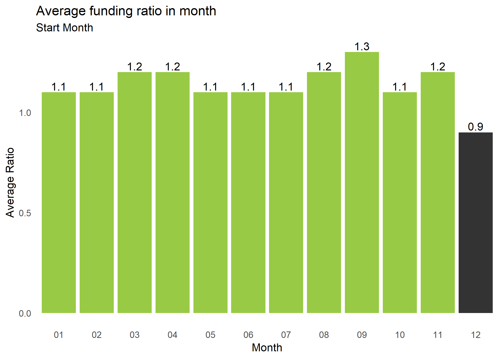
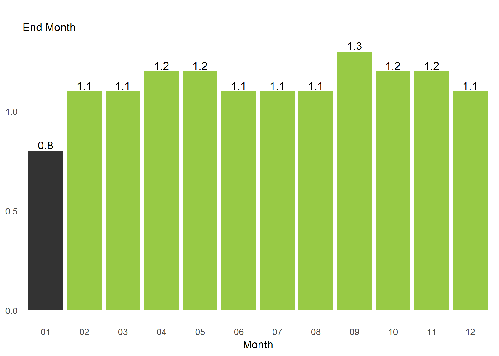

#### **To: **  
  
#### **From: Huy Le**  
  
#### **Date: `r format(Sys.time(), '%B %d, %Y')`**   
  
#### **RE: **  

***

```{r echo = FALSE}
# Course: BUAN 5210
# Title: HTML Story telling
# Purpose: Kicstarter story telling
# Date: March 21, 2019
# Author: Huy Le

```


```{r echo = FALSE}
# Clear environment of variables and functions
rm(list = ls(all = TRUE)) 

# Clear environmet of packages
if(is.null(sessionInfo()$otherPkgs) == FALSE)lapply(paste("package:", names(sessionInfo()$otherPkgs), sep=""), detach, character.only = TRUE, unload = TRUE)

```


```{r echo = FALSE, message = FALSE, warning = FALSE}
# Load librarys
# NOT LOADING LIBRARIES SINCE DOING EVERYTHING IN BASE R

```

Over the past decade, we have witnessed increasing popularity in crowdfunding. Crowdfunding is the practice of funding a project or venture by raising many small amounts of money from a large number of people, typically through the internet. Due to its easy accessibility and broad exposure to the public, entrepreneurs and aspiring creators seek to utilize the platform to raise money for their projects.

Kickstarter, launched in 2009, is one of the major crowdfunding platforms which focused on bringing creativity project to life along with Indiegogo, Rocket Hub and GoFundMe. 
In Kickstarter, “Creators” are people behind the projects who are seeking funding. “Backers” are people who pledge money for projects they believe in and “pledges” are monetary contributions towards the projects. Kickstarter has a unique “All-or-nothing” model, meaning unless a project reaches its funding goal, no backer will be charged any pledge towards a project. On the one hand, it is less risky for backers because projects that are not fully funded have less likelihood of completion. On the other hand, it adds more incentive for creators to connect with the public and to finish their projects. Another unique feature of Kickstarter is that backers will only be rewarded in experience or creative products instead of equity.

Although numerous projects have been successfully funded on Kickstarter, the aggregated average success rate is not as high as expected. Data have shown that the average success rate of Kickstarter campaigns was 39% in 2017. This fact raises an important question for creators and backers “What are the key factors for a successful crowdfunding campaign in Kickstarter?”. 

In this story, I seek to explore factors that affect the success of the Kickstarter campaign. I only consider the characteristics of a campaign in Kickstarter and holding other factors of projects itself such as product details, marketing campaign, white paper, brochure. I believe that success rate differs across different categories and hypothesize that backers, minimum goal, project length and launched month have a strong relationship with campaign success. I collected my data from Kaggle.com the open online database. The dataset includes the information of all project on Kickstarter from 2009 to 2018 with about 380,000 observations and 16 variables. In this analysis, I only focus on the data in 2017.

After the first pass with these data, I found that number of backers is the most important factor which influent to the success of a crowdfunding campaign. Since the more backers you have, the higher the chance for you to reach the goal. This thing leads to 2 interesting finding:

+ Backers are less likely to put their money into projects which set up an impossible goal.
+ They also do not favor projects which take too much time to complete crowdfunding.

This graph below present the average USD goal of projects divided into state and main category

{width=600px}

From this graph, we can easily recognize the pattern. The failed project always set its goal higher than a successful project. In some category, these gaps are significant. Film & video, for instance, the Failed project has a goal 20 times higher than a successful project. Overall, the average goal of a failed project is 5 times higher than a successful one. Explanations for this problem is that too high goal seems to be impossible to reach within the funding period (0-60 days), thus backs will not donate their money to these impossible missions.

In terms of duration, I observed that backers tend to invest their money to projects which take length between 20 and 40 days more than those others. The graph below presents my finding:

{width=600px}

the y-axis represents the number of backers and the x-axis represents the length of a project and each does represent for one project in the dataset. We can easily recognize that numerous projects between 20 and 40 days have a higher number of backers than others outside the range. To assess more detail in this trend I implemented a further analysis to evaluate the success rate and duration.

{width=600px}

This graph presents the correlation between success rate of a project and its length. We see that those 20 and 40 days projects have a higher success rate with those others. This trend quite similar to the trend to the previous graph. Hence, I have convincing evidence to say that the project is from 20 to 40 days in length get a higher success rate.

Finally, another interesting finding is about the time to start a crowdfunding campaign. Below is a graph that overlate the average ratio (USD pledged/goal) of projects that launched(star-month) or ended(end-month) in a given month. The trend is pretty clear to see.

{width=400px}
{width=400px}

A Ratio >1 indicates that the project reached its goal within its duration. In these graphs, the average ratio is lower than 1 if the projects were launched in December or ended in January.

In conclusion, backers it’s the most important factor that creators should concern most. To increase the success rate of their crowdfunding on Kickstarter, creators should consider how to attract more backers. There are two factors that backers care a lot on projects: goal and duration. Too high goal or too long duration do not help to receive more support from backers, since this kind of projects seems to be impossible to reach their goal. Hence, creatros should set a reachable goal correspond to its duration. If a project needs a large amount of money, creators should consider dividing funding campaign into many phrase with a smaller goal. My analysis shows that, an ideal duration for a project is from 20 to 40 day. Within this range, the project has a higher successful rate. Finally, creators should avoid to start a project in December or end it in January. Project launched or ended in these months face a lower than 1 funding ration.

Please do not hesitate to contact us if you have questions or would like to discuss the analysis further. We can also provide our complete analysis with data, code, and additional graphs and tables if you would like more details. We look forward to working with you in the future as you continue to optimize and reevaluate your sales and marketing strategies.

Best regards,

Huy Le
